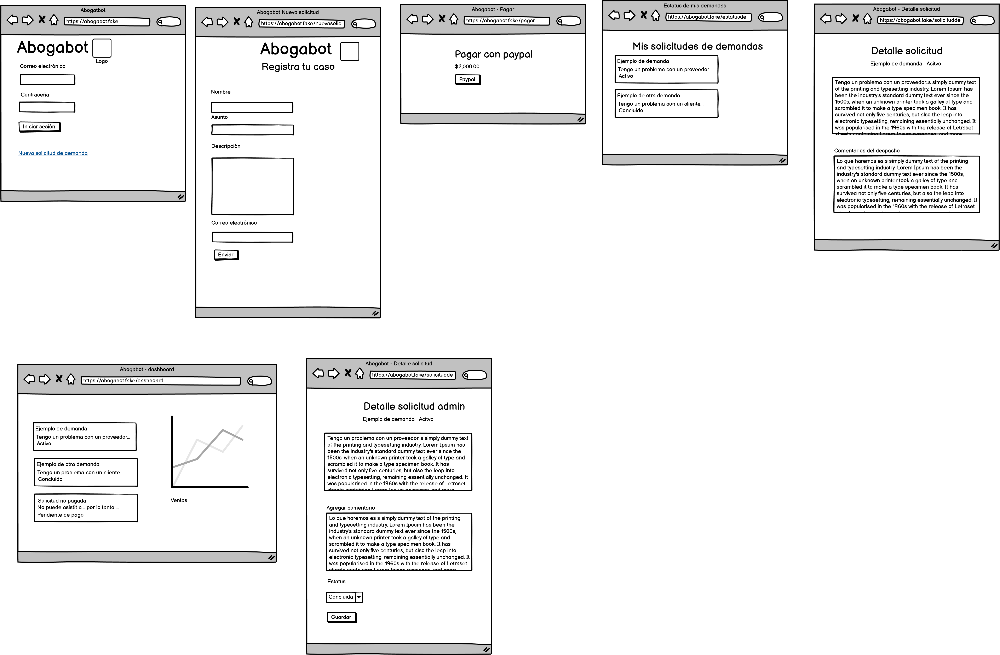
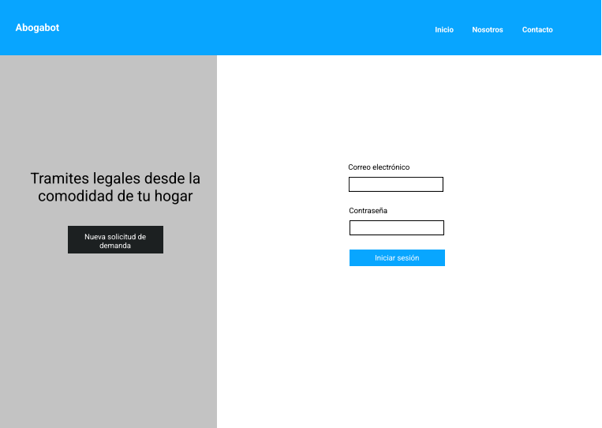
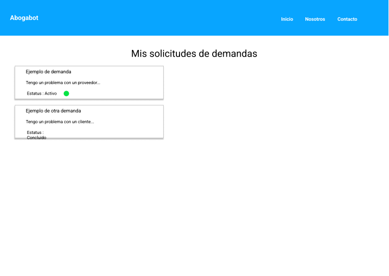

# Abogabot-LaunchX
Proyecto de práctica Abogabot

[Toma de requerimientos](https://github.com/andresGuevaraRojas/Abogabot-LaunchX/blob/main/docsRequerimientosAbogabot.pdf)

[Buyer persona](https://www.figma.com/file/CFvFgYr1dkWUDHGeFGe54j/Buyer-Persona-Abogabot?node-id=0%3A1)

[Público objetivo](https://miro.com/app/board/uXjVOJmtbSQ=/?invite_link_id=639301065723)

[Fireframe](https://github.com/andresGuevaraRojas/Abogabot-LaunchX/blob/main/docs/Abogabot%20Firewrame%201.pdf)

[Interfaz de usuario](https://www.figma.com/file/IxtHfBUYM7xOGVajJfp98Y/Abogabot-Dise%C3%B1o)

